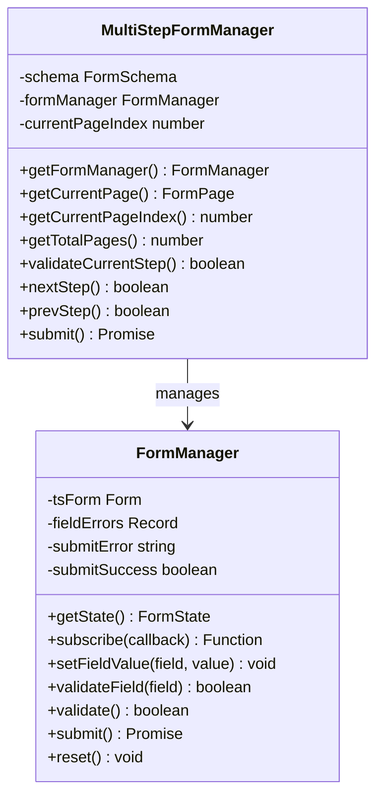

# Headless Form Engine Architecture

This document describes the architectural layout, class mechanics, and integration details of the headless dynamic form state engine in `@intuitui-labs/form-builder-engine`.

---

## 1. Class Structure

The engine provides two key state managers to coordinate form states:



### FormManager (`src/manager/FormManager.ts`)
A wrapper encapsulating `@tanstack/form-core`'s state engine. It handles:
* **State synchronization**: Runs an observable store that components can subscribe to.
* **Granular Updates**: Feeds keystrokes into the TanStack state manager.
* **Dynamic Validation**: Coordinates field checking using `ValidationEngine` and custom JSON validators.

### MultiStepFormManager (`src/manager/MultiStepFormManager.ts`)
A state coordinator designed for paginated flows (wizards).
* Rather than instantiating a form store per step, it flattens all pages' fields into a **single, global FormManager**.
* This preserves values even when the user goes back and forth between steps.
* Restricts validation checks solely to the fields on the current active page, enabling localized routing barriers.

---

## 2. API Usage Examples

### Running a Basic Form (Single Page)
```typescript
import { FormManager } from '@intuitui-labs/form-builder-engine';

const form = new FormManager({
  fields: {
    username: { type: 'text', required: true, defaultValue: '' }
  },
  onSubmit: async (values) => {
    console.log('Sending payload:', values);
  }
});

// Subscribe to state updates
const unsubscribe = form.subscribe((state) => {
  console.log('Values:', state.values);
  console.log('Errors:', state.errors);
});

// Update fields
form.setFieldValue('username', 'Naveen');

// Submit
await form.submit();
```

### Running a Multi-Step Wizard Form
```typescript
import { MultiStepFormManager } from '@intuitui-labs/form-builder-engine';

const schema = {
  v: '1.0',
  id: 'form-123',
  title: 'Survey',
  pages: [
    {
      id: 'step-1',
      fields: [{ id: 'f1', name: 'email', type: 'email', required: true }]
    },
    {
      id: 'step-2',
      fields: [{ id: 'f2', name: 'feedback', type: 'textarea', required: false }]
    }
  ]
};

const wizard = new MultiStepFormManager(schema, async (values) => {
  console.log('Submitting all wizard steps:', values);
});

// Go to next step (will block if step 1 validation fails)
const success = wizard.nextStep(); 
```
